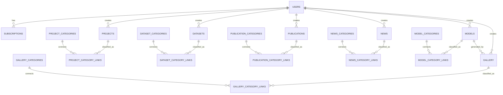

# **ERD Final (Multi-Category Version)**

Dokumen ini berisi rancangan database lengkap dalam bentuk **Markdown**, dengan dukungan **multi-category untuk setiap item**, sesuai kebutuhan sistem: Projects, Datasets, Publications, News, Models, Gallery.

Struktur dibuat scalable, modular, dan mengikuti standard relational database (PostgreSQL-friendly), sudah siap digunakan sebagai referensi pembuatan Alembic Migration, SQLAlchemy Models, atau dokumentasi internal.

---

# 🧩 **1. Core Concepts**

Karena setiap konten bisa memiliki **lebih dari satu kategori**, maka digunakan pola relasi:

```
CONTENT (projects, datasets, etc)
   ⬇ many-to-many
CONTENT_CATEGORY_LINK
   ⬇ many-to-one
CONTENT_CATEGORY (per domain)
```

Desain ini lebih fleksibel dibanding single category.

---

# 📐 **2. ERD (Mermaid Diagram)**



---

# 🧱 **3. Tabel Inti (Core Tables)**

## ### **3.1 USERS**

Menyimpan data pengguna sistem.

| Kolom         | Tipe                             | Deskripsi          |
| ------------- | -------------------------------- | ------------------ |
| id            | UUID                             | Primary key        |
| name          | VARCHAR                          | Nama user          |
| email         | VARCHAR UNIQUE                   | Email login        |
| password_hash | TEXT                             | Password tersimpan |
| role          | ENUM(admin, registered, premium) | Hak akses          |
| is_active     | BOOLEAN                          | Status account     |
| created_at    | TIMESTAMP                        | Timestamp          |
| updated_at    | TIMESTAMP                        | Timestamp          |

---

## ### **3.2 SUBSCRIPTIONS**

Menyimpan langganan premium user.

| Kolom       | Tipe                           | Deskripsi            |
| ----------- | ------------------------------ | -------------------- |
| id          | UUID                           | Primary key          |
| user_id     | FK → users                     | Pemilik langganan    |
| plan_name   | VARCHAR                        | Paket langganan      |
| price       | NUMERIC                        | Harga                |
| status      | ENUM(active, expired, pending) | Status               |
| start_date  | TIMESTAMP                      | Mulai                |
| end_date    | TIMESTAMP                      | Akhir                |
| payment_ref | VARCHAR                        | Referensi pembayaran |

---

# 🔎 **4. Tabel Konten (Content Tables)**

## ### **4.1 PROJECTS**

| Kolom         | Tipe                              | Deskripsi        |
| ------------- | --------------------------------- | ---------------- |
| id            | UUID                              | Primary key      |
| title         | VARCHAR                           | Judul project    |
| slug          | VARCHAR UNIQUE                    | URL identifier   |
| description   | TEXT                              | Deskripsi        |
| thumbnail_url | TEXT                              | Thumbnail        |
| tags          | TEXT[]                            | Tag tambahan     |
| access_level  | ENUM(public, registered, premium) | Hak akses        |
| status        | ENUM(draft, published)            | Status publikasi |
| created_by    | FK → users                        | Creator          |
| created_at    | TIMESTAMP                         | Timestamp        |
| updated_at    | TIMESTAMP                         | Timestamp        |

---

## ### **4.2 DATASETS**

| Kolom            | Tipe           | Deskripsi         |
| ---------------- | -------------- | ----------------- |
| id               | UUID           | PK                |
| name             | VARCHAR        | Nama dataset      |
| slug             | VARCHAR UNIQUE | URL identifier    |
| description      | TEXT           | Deskripsi dataset |
| sample_image_url | TEXT           | Contoh gambar     |
| file_url         | TEXT           | Link file         |
| source           | VARCHAR        | Sumber dataset    |
| size             | BIGINT         | Ukuran            |
| access_level     | ENUM           | Hak akses         |
| status           | ENUM           | Status publikasi  |
| created_by       | FK → users     | Pembuat           |
| created_at       | TIMESTAMP      |                   |
| updated_at       | TIMESTAMP      |                   |

---

## ### **4.3 PUBLICATIONS**

| Kolom                  | Tipe       |
| ---------------------- | ---------- |
| id                     | UUID       |
| title                  | VARCHAR    |
| slug                   | VARCHAR    |
| abstract               | TEXT       |
| pdf_url                | TEXT       |
| journal_name           | VARCHAR    |
| year                   | INTEGER    |
| graphical_abstract_url | TEXT       |
| access_level           | ENUM       |
| status                 | ENUM       |
| created_by             | FK → users |
| created_at             | TIMESTAMP  |
| updated_at             | TIMESTAMP  |

---

## ### **4.4 NEWS**

| Kolom         | Tipe            |
| ------------- | --------------- |
| id            | UUID            |
| title         | VARCHAR         |
| slug          | VARCHAR         |
| content       | TEXT — markdown |
| thumbnail_url | TEXT            |
| tags          | TEXT[]          |
| access_level  | ENUM            |
| status        | ENUM            |
| created_by    | FK              |
| created_at    | TIMESTAMP       |
| updated_at    | TIMESTAMP       |

---

## ### **4.5 MODELS**

| Kolom          | Tipe      |                         |
| -------------- | --------- | ----------------------- |
| id             | UUID      |                         |
| name           | VARCHAR   |                         |
| slug           | VARCHAR   |                         |
| architecture   | VARCHAR   |                         |
| dataset_used   | VARCHAR   |                         |
| metrics        | JSONB     | (accuracy, f1, fid ...) |
| description    | TEXT      |                         |
| model_file_url | TEXT      |                         |
| access_level   | ENUM      |                         |
| status         | ENUM      |                         |
| created_by     | FK        |                         |
| created_at     | TIMESTAMP |                         |
| updated_at     | TIMESTAMP |                         |

---

## ### **4.6 GALLERY**

| Kolom      | Tipe        |
| ---------- | ----------- |
| id         | UUID        |
| prompt     | TEXT        |
| image_url  | TEXT        |
| model_id   | FK → models |
| metadata   | JSONB       |
| created_by | FK          |
| created_at | TIMESTAMP   |

---

# 🗂️ **5. Tabel Categories (Per Domain)**

## Struktur kategori untuk setiap jenis konten:

Semua kategori punya struktur konsisten:

| Kolom       | Tipe           |
| ----------- | -------------- |
| id          | UUID           |
| name        | VARCHAR        |
| slug        | VARCHAR UNIQUE |
| description | TEXT           |
| created_at  | TIMESTAMP      |

Kategori per domain:

* `project_categories`
* `dataset_categories`
* `publication_categories`
* `news_categories`
* `model_categories`
* `gallery_categories`

---

# 🔗 **6. Tabel Link Many-to-Many (Category Link Tables)**

Karena 1 item bisa punya banyak kategori:

### **6.1 PROJECT_CATEGORY_LINKS**

| Kolom                           | Tipe                    |
| ------------------------------- | ----------------------- |
| id                              | UUID                    |
| project_id                      | FK → projects           |
| category_id                     | FK → project_categories |
| created_at                      | TIMESTAMP               |
| UNIQUE(project_id, category_id) |                         |

---

### **6.2 DATASET_CATEGORY_LINKS**

| Kolom       | Tipe                    |
| ----------- | ----------------------- |
| id          | UUID                    |
| dataset_id  | FK → datasets           |
| category_id | FK → dataset_categories |
| created_at  | TIMESTAMP               |

---

### **6.3 PUBLICATION_CATEGORY_LINKS**

| Kolom          | Tipe                        |
| -------------- | --------------------------- |
| id             | UUID                        |
| publication_id | FK → publications           |
| category_id    | FK → publication_categories |
| created_at     | TIMESTAMP                   |

---

### **6.4 NEWS_CATEGORY_LINKS**

| Kolom       | Tipe                 |
| ----------- | -------------------- |
| id          | UUID                 |
| news_id     | FK → news            |
| category_id | FK → news_categories |

---

### **6.5 MODEL_CATEGORY_LINKS**

| Kolom       | Tipe                  |
| ----------- | --------------------- |
| id          | UUID                  |
| model_id    | FK → models           |
| category_id | FK → model_categories |

---

### **6.6 GALLERY_CATEGORY_LINKS**

| Kolom       | Tipe                    |
| ----------- | ----------------------- |
| id          | UUID                    |
| gallery_id  | FK → gallery            |
| category_id | FK → gallery_categories |

---

# 🎯 Final Notes

✔ Setiap konten (project, dataset, model, dll.) dapat memiliki **banyak kategori**.
✔ Kategori dipisah per domain agar **lebih rapi dan fleksibel**.
✔ Masing-masing domain punya tabel link many-to-many.
✔ Desain ini scalable untuk admin panel dan filtering frontend.

---